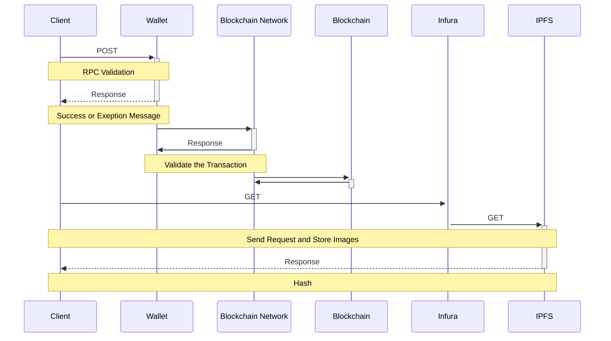

# NFT-Minting-Collection-App
## Description

```mermaid
sequenceDiagram
Client->>+Wallet: POST
Note over Client,Wallet: RPC Validation
Wallet-->>-Client: Response
Note over Client,Wallet: Success or Exeption Message
Wallet->>+Blockchain Network: 
Blockchain Network->>-Wallet: Response
Note over Blockchain Network,Wallet: Validate the Transaction
Blockchain Network->>+Blockchain: 
Blockchain->>-Blockchain Network: 
Client->>+Infura: GET
Infura->>+IPFS: GET
Note over Client,IPFS: Send Request and Store Images
IPFS-->>-Client: Response
Note over IPFS, Client: Hash
```
