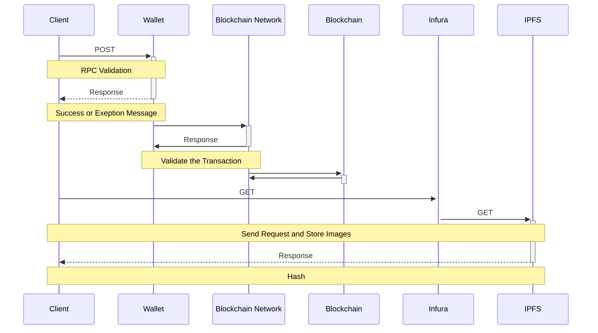

# NFT-Minting-Collection-App

 Package                                                   | Version                                                                                                                                       | Desc                                                                      |
|-----------------------------------------------------------|-----------------------------------------------------------------------------------------------------------------------------------------------|---------------------------------------------------------------------------|
| [`ethers`](packages/types)                     |                                          |Complete Ethereum library and wallet implementation in JavaScript.|

## Description

