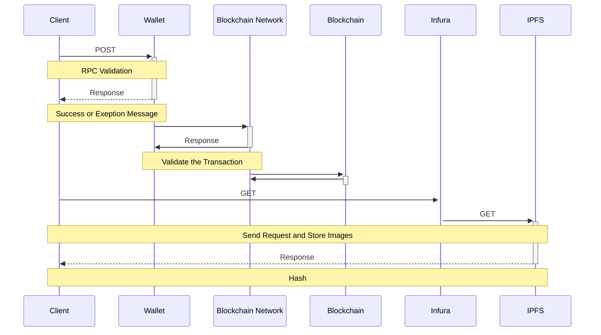

# NFT-Minting-Collection-App

 Package                                                   | Version                                                                                                                                       | Desc                                                                      |
|-----------------------------------------------------------|-----------------------------------------------------------------------------------------------------------------------------------------------|---------------------------------------------------------------------------|
| [`ethers`](https://github.com/ethers-io/ethers.js)                     |                                          |Complete Ethereum library and wallet implementation in JavaScript.|
| [`web3modal`](https://github.com/WalletConnect/web3modal)                     |                                          |A single Web3 / Ethereum provider solution for all Wallets|
| [`popup`](https://github.com/FaruNuriSonmez/react-examples/tree/components/popup)                     | |React popup component|

   

## Description

